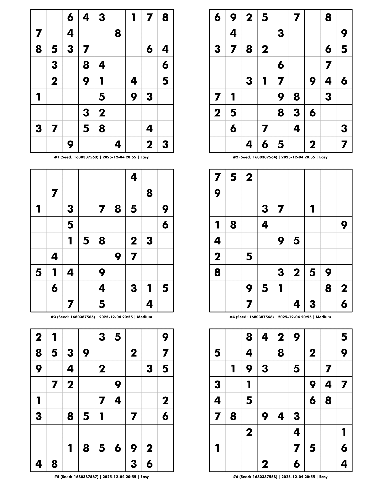

# 🧩 SudokuPrintGen

[](https://github.com/andrew867/SudokuPrintGen/actions/workflows/ci.yml)
[](https://github.com/andrew867/SudokuPrintGen/actions/workflows/release.yml)
[](https://github.com/andrew867/SudokuPrintGen/releases/latest)
[](https://opensource.org/licenses/MIT)

**Enterprise-grade LaTeX Sudoku Generator** - Beautiful, press-ready PDFs with a blazing-fast SIMD-optimized solver.

Built with .NET 8 C# and TikZ graphics, SudokuPrintGen produces publication-quality output suitable for books, magazines, and print media.

<p align="center">
  
  <br>
  <em>Example output - 8 puzzles per page with mixed difficulties</em>
  <br>
  <a href="docs/sample/sudoku_combined_20251204_205536.pdf">📄 View Full Sample PDF</a>
</p>

---

## 📥 Download

Pre-built binaries are available for all major platforms. **No .NET installation required** - the application is fully self-contained.

| Platform | Architecture | Download |
|----------|--------------|----------|
| Windows | x64 | [SudokuPrintGen-win-x64.zip](https://github.com/andrew867/SudokuPrintGen/releases/latest/download/SudokuPrintGen-win-x64.zip) |
| Linux | x64 | [SudokuPrintGen-linux-x64.zip](https://github.com/andrew867/SudokuPrintGen/releases/latest/download/SudokuPrintGen-linux-x64.zip) |
| macOS | Intel (x64) | [SudokuPrintGen-osx-x64.zip](https://github.com/andrew867/SudokuPrintGen/releases/latest/download/SudokuPrintGen-osx-x64.zip) |
| macOS | Apple Silicon (ARM64) | [SudokuPrintGen-osx-arm64.zip](https://github.com/andrew867/SudokuPrintGen/releases/latest/download/SudokuPrintGen-osx-arm64.zip) |

### Quick Install

**Windows:**
```powershell
# Download and extract
Invoke-WebRequest -Uri "https://github.com/andrew867/SudokuPrintGen/releases/latest/download/SudokuPrintGen-win-x64.zip" -OutFile "SudokuPrintGen.zip"
Expand-Archive -Path "SudokuPrintGen.zip" -DestinationPath "."

# Run
.\SudokuPrintGen-win-x64\SudokuPrintGen.CLI.exe --version
```

**Linux/macOS:**
```bash
# Download and extract (Linux example)
curl -LO https://github.com/andrew867/SudokuPrintGen/releases/latest/download/SudokuPrintGen-linux-x64.zip
unzip SudokuPrintGen-linux-x64.zip

# Make executable and run
chmod +x SudokuPrintGen-linux-x64/SudokuPrintGen.CLI
./SudokuPrintGen-linux-x64/SudokuPrintGen.CLI --version
```

---

## ✨ Key Features

### 🚀 High-Performance Puzzle Generation
- **Pure C# SIMD-optimized DPLL solver** using `System.Runtime.Intrinsics` (AVX2/SSE)
- **Multiple difficulty levels**: Easy, Medium, Hard, Expert, Evil
- **Puzzle variants**: Classic, Diagonal, Color-Constrained, Kikagaku
- **Configurable board sizes**: 4×4, 6×6, 9×9, 12×12, 16×16
- **Reproducible generation** with seed support
- **Advanced difficulty analysis** with 8 solving technique detectors
- **Symmetry detection** (rotational, horizontal, vertical, diagonal)

### 📄 Multiple Output Formats
- **LaTeX (.tex)** - Full source for customization
- **PDF** - Beautiful press-ready output via XeLaTeX
- **TXT** - Simple 81-character puzzle strings
- **JSON** - Structured data with full metadata

### 🎨 Beautiful PDF Generation
- **TikZ graphics** for precise, vector-based grids
- **Perfectly square cells** with consistent line weights
- **Thin gray lines** (0.3pt) for cell borders
- **Thick black lines** (1.2pt) for 3×3 box borders
- **Bundled Futura Bold BT font** (auto-copied during build)
- **Custom font support** (TTF files or system fonts)
- **Multi-puzzle layouts**: 8 puzzles per page (2 columns × 4 rows)
- **Optimized for Letter size** (8.5" × 11") paper

### 📋 Multi-Puzzle Features
- Batch generation with **mixed difficulties**
- **Automatic page balancing**
- Individual puzzle footers (number, seed, date, difficulty)
- Combined LaTeX/PDF output with timestamp naming

---

## 🚀 Quick Start

### Prerequisites

For **PDF generation only** (not required for other formats):
- **LaTeX distribution**:
  - Windows: [MikTeX](https://miktex.org/)
  - Linux: TeX Live (`sudo apt install texlive-xetex`)
  - macOS: [MacTeX](https://www.tug.org/mactex/)

### Using Pre-built Binaries

```bash
# Generate 8 medium puzzles as PDF
./SudokuPrintGen.CLI generate -c 8 -d Medium -f pdf

# Show version
./SudokuPrintGen.CLI --version

# Show help
./SudokuPrintGen.CLI
```

### Building from Source

**Prerequisites for building:**
- **.NET 8.0 SDK**

**Windows:**
```powershell
.\build\build.ps1
```

**Linux/macOS:**
```bash
./build/build.sh
```

**Or simply:**
```bash
dotnet build
```

#### Build Script Options

The build scripts support additional options for creating release builds:

**Windows (PowerShell):**
```powershell
# Standard build
.\build\build.ps1

# Release build
.\build\build.ps1 -Release

# Skip tests
.\build\build.ps1 -SkipTests

# Create self-contained publish
.\build\build.ps1 -Publish -Runtime win-x64
```

**Linux/macOS (Bash):**
```bash
# Standard build
./build/build.sh

# Release build
./build/build.sh --release

# Skip tests
./build/build.sh --skip-tests

# Create self-contained publish
./build/build.sh --publish --runtime linux-x64
```

**Available runtime identifiers:** `win-x64`, `linux-x64`, `osx-x64`, `osx-arm64`

---

## 📖 Usage Examples

### Generate 8 medium puzzles as PDF
```bash
./SudokuPrintGen.CLI generate -c 8 -d Medium -f pdf
```

### Mixed difficulties with custom seed
```bash
./SudokuPrintGen.CLI generate -c 12 -d Easy,Medium,Hard --seed 12345
```

### Use system font instead of bundled
```bash
./SudokuPrintGen.CLI generate -c 4 --system-font Arial -f pdf
```

### Generate all formats
```bash
./SudokuPrintGen.CLI generate -c 1 -d Expert -f all
```

### Generate with solving sheet and solution
```bash
./SudokuPrintGen.CLI generate -d Hard --solving-sheet --solution
```

### Use configuration file
```bash
./SudokuPrintGen.CLI generate --config config.example.json
```

### Using dotnet run (from source)
```bash
dotnet run --project src/SudokuPrintGen.CLI/SudokuPrintGen.CLI -- generate -c 8 -d Medium -f pdf
```

---

## ⚙️ Command-Line Options

```
sudoku-printgen generate [options]

Options:
  --size, -s <int>           Board size (4, 6, 9, 12, 16) [default: 9]
  --difficulty, -d <level>   Easy|Medium|Hard|Expert|Evil [default: Medium]
                             (comma-separated for mixed: Easy,Medium,Hard)
  --variant, -v <type>       Classic|Diagonal|ColorConstrained|Kikagaku [default: Classic]
  --count, -n, -c <int>      Number of puzzles to generate [default: 1]
  --output, -o <path>        Output directory [default: .]
  --format, -f <type>        tex|txt|pdf|json|all [default: all]
  --engine <engine>          pdflatex|xelatex [default: xelatex]
  --font <path>              Path to TTF font file (xelatex only)
  --system-font <name>       Use installed system font by name (xelatex only)
  --no-bundled-font          Don't use bundled Futura Bold BT font
  --title <text>             Puzzle title
  --author <text>            Author name
  --seed <int>               Random seed for reproducibility
  --solution                 Include solution in output
  --solving-sheet            Include solving sheet (empty grid)
  --puzzles-per-page <int>   Puzzles per page: 6 (larger, 2x3) or 8 (2x4) [default: 6]
  --config <path>            Configuration file (JSON)

Difficulty Targeting Options:
  --refine-difficulty        Use iterative refinement for accurate difficulty targeting
  --show-statistics          Display generation statistics after completion
  --verbose                  Show detailed progress during generation

Other Commands:
  --version, -V              Show version information
```

---

## 📁 Project Structure

```
SudokuPrintGen/
├── .github/
│   └── workflows/               # CI/CD pipelines
│       ├── ci.yml               # Build & test on push/PR
│       └── release.yml          # Multi-platform releases
├── src/
│   ├── SudokuPrintGen.Core/     # Core library
│   │   ├── Configuration/       # Generator configuration
│   │   ├── Puzzle/              # Board, Generator, DifficultyRater
│   │   ├── Solver/              # DPLL solver with SIMD optimizations
│   │   ├── LaTeX/               # TikZ-based grid generation
│   │   └── Output/              # Multi-format writers, PDF compiler
│   └── SudokuPrintGen.CLI/      # Command-line interface
├── tests/
│   └── SudokuPrintGen.Tests/    # 143 unit tests
├── fonts/                       # Bundled Futura fonts
├── templates/latex/             # LaTeX templates
├── build/                       # Build scripts (PowerShell & Bash)
└── docs/                        # Documentation
```

---

## 🛠️ Technical Architecture

### Core Library Components

| Component | Description |
|-----------|-------------|
| `Board.cs` | Sudoku board representation with clone/validation |
| `Generator.cs` | Puzzle generation with SIMD-optimized solver |
| `DpllSolver.cs` | Davis-Putnam-Logemann-Loveland algorithm with metrics |
| `SolverResult.cs` | Solver metrics (iterations, depth, guesses) |
| `SimdConstraintPropagator.cs` | AVX2/SSE hardware-accelerated operations |
| `TechniqueDetector.cs` | Advanced solving technique detection (8 techniques) |
| `DifficultyRater.cs` | Metrics and technique-based difficulty analysis |
| `DifficultyTargets.cs` | Iteration ranges and score thresholds |
| `PuzzleRefiner.cs` | Iterative difficulty refinement |
| `ClueAnalyzer.cs` | Strategic clue management |
| `GenerationStatistics.cs` | Batch generation statistics tracking |
| `SymmetryDetector.cs` | Pattern detection algorithms |
| `LaTeXGenerator.cs` | TikZ-based grid generation |
| `PdfCompiler.cs` | XeLaTeX/pdfLaTeX compilation |

### Solver Performance

The solver uses cutting-edge optimizations:
- **DPLL Algorithm** with constraint propagation
- **SIMD Intrinsics** via `System.Runtime.Intrinsics`:
  - Vectorized candidate initialization and elimination
  - Hardware `PopCount` for efficient bit counting
  - Automatic fallback to scalar operations when unavailable
- **Bit-vector operations** for efficient candidate tracking
- **Pure C#** - No native dependencies, fully cross-platform

---

## 📊 Output Files

Generated files follow this naming convention:

| Format | Filename | Description |
|--------|----------|-------------|
| TXT | `sudoku_{difficulty}_seed_{seed}.txt` | 81-character puzzle string |
| JSON | `sudoku_{difficulty}_seed_{seed}.json` | Full metadata + puzzle/solution arrays |
| LaTeX | `sudoku_combined_{timestamp}.tex` | TikZ source (multi-puzzle) |
| PDF | `sudoku_combined_{timestamp}.pdf` | Press-ready output |

### JSON Metadata Includes:
- Seed, puzzle number, generation timestamp
- Difficulty level and variant type
- Solver algorithm ("DPLL")
- Difficulty rating (clue count, techniques required)
- Symmetry analysis (types detected, score)

---

## 🎯 Advanced Features

### Iteration-Based Difficulty System

SudokuPrintGen uses a research-backed approach to difficulty targeting based on solver metrics:

| Difficulty | Iteration Range | Description |
|------------|-----------------|-------------|
| Easy       | 1-10            | Minimal backtracking required |
| Medium     | 11-25           | Some deduction needed |
| Hard       | 26-80           | Advanced techniques required |
| Expert     | 81-350          | Significant backtracking |
| Evil       | 351+            | Maximum difficulty |

#### Iterative Refinement
Enable with `--refine-difficulty` for accurate targeting:
```bash
./SudokuPrintGen.CLI generate -d Hard --refine-difficulty
```

The system:
1. Generates initial puzzle with approximate clue count
2. Measures actual difficulty using solver metrics
3. Iteratively adjusts clues until difficulty matches target

#### Statistics Report
Enable with `--show-statistics`:
```
=== Generation Statistics Report ===

Difficulty    | Count | Avg Iter | Std Dev | Success % | Avg Score
--------------|-------|----------|---------|-----------|----------
Medium        |     5 |     17.4 |    3.21 |      80.0% |     14.2
```

See [docs/DifficultySystem.md](docs/DifficultySystem.md) for complete documentation.

### Difficulty Rating & Technique Detection

Puzzles are automatically analyzed using solver metrics and technique detection:

**Solver Metrics:**
- Iteration count (primary metric)
- Max backtrack depth and guess count
- Clue count and empty cell ratio

**Detected Solving Techniques (ordered by difficulty):**

| Technique | Weight | Description |
|-----------|--------|-------------|
| Naked Single | 1 | Cell with only one candidate |
| Hidden Single | 2 | Digit can only go in one cell in a unit |
| Naked Pair | 4 | Two cells with identical 2-candidate sets |
| Hidden Pair | 5 | Two digits appearing in exactly 2 cells |
| X-Wing | 8 | Fish pattern across 2 rows/columns |
| XY-Wing | 10 | Three-cell chain elimination pattern |
| Swordfish | 12 | Fish pattern across 3 rows/columns |
| XYZ-Wing | 14 | Three-cell chain with pivot having 3 candidates |

**Composite Scoring:**
- 40% solver iterations + 20% technique score + 15% backtrack depth + 15% guesses + 10% clue ratio
- Technique score = hardest technique weight + bonus for variety

### Symmetry Detection
The generator detects and reports:
- Rotational symmetry (180-degree)
- Horizontal and vertical reflection
- Diagonal symmetry
- Overall symmetry score

### Multi-Puzzle Layouts
When generating multiple puzzles:
- **Layout**: 2 columns × 4 rows = 8 puzzles per page
- **Paper size**: Letter (8.5" × 11")
- **Individual footers**: Each puzzle shows its number, seed, date, difficulty
- **Automatic pagination**: Additional puzzles continue on new pages
- **Balanced distribution**: Puzzles distributed evenly across pages

---

## ✅ Testing

Run all tests:
```bash
dotnet test
```

Test coverage includes:
- Board operations and validation
- Solver correctness and uniqueness checking
- Solver metrics tracking (iterations, depth, guesses)
- Generator with various difficulties
- Difficulty rating algorithms
- Difficulty targets and ranges
- Iterative refinement process
- Generation statistics tracking
- Symmetry detection
- PDF compilation
- Difficulty distribution for mixed batches
- Technique detection (all 8 techniques)
- Technique scoring integration

---

## 🔄 CI/CD

This project uses GitHub Actions for continuous integration and automated releases:

- **CI Pipeline** (`ci.yml`): Runs on every push and PR to `main`
  - Builds and tests on Ubuntu, Windows, and macOS
  - Ensures cross-platform compatibility

- **Release Pipeline** (`release.yml`): Triggered by version tags (`v*`)
  - Builds self-contained executables for all platforms
  - Creates GitHub Release with downloadable archives
  - Generates release notes automatically

### Creating a Release

```bash
# Tag the release
git tag v1.0.0

# Push the tag
git push origin v1.0.0
```

GitHub Actions will automatically build and publish the release.

---

## 🎯 Future Roadmap

- [ ] Web API / REST interface
- [ ] GUI application (WPF/Avalonia)
- [ ] Additional puzzle variants
- [ ] More export formats (SVG, PNG)
- [ ] Batch processing CLI improvements
- [ ] Puzzle book generation mode

---

## 📜 License

MIT License - See [LICENSE](LICENSE) for details.

---

## 🤝 Contributing

Contributions are welcome! Please feel free to submit a Pull Request.

1. Fork the repository
2. Create your feature branch (`git checkout -b feature/AmazingFeature`)
3. Commit your changes (`git commit -m 'Add some AmazingFeature'`)
4. Push to the branch (`git push origin feature/AmazingFeature`)
5. Open a Pull Request

---

Built with ❤️ for puzzle enthusiasts and publishers.
